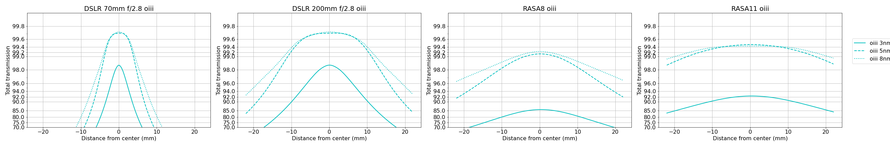
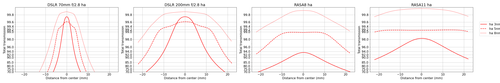

## Narrowband imaging at fast F-ratios

I've read often that tight narrowband filters are not suitable for fast f-ratio systems due to the bandpass shift of the steep light-cone.  Most of the discussion centers around the extreme ends of the light cone, and how its angle shifts the bandpass of the filter so much that the narrowband light falls off the peak of the transmission curve and ruins any image you might hope to get.  This argument neglects two important effects: the optical paths in the light cone that do not have that extreme an incident angle, and the pixel location on the chip.  I decided to try and do an analysis of both to get a better feel for how tight a bandpass you can get away with for different filters and sensors.  Calculation details are shown explicitly [here](bandpass_shift_nb.ipynb).

I obtained filter transmission graphs from Chroma's website.  It's great to be able to download these files rather than reading the data off a static graph.  They also have an inspector for transmission and optical density so you can check the transmission directly on the graph at different wavelengths.  Kudos to them for having that available.  I will say that while I'm using Chroma filters for this comparison, the results here are by no means applicable to all narrowband filters with identical bandpass, etc. since these filters will have variation in the shape and exact location of the peak transmission.  Further, even different batches from the same company may have small variations.  The intent here is to communicate various effects and general conclusions.  For the calculations below, I'm assuming a refractive index of 1.8 for the glass used in these filters.  

Assuming the peak transmission is right on the emission line, we can compute where minimum F-ratio where there's significant loss in transmission.  The bandpass shift at the maximum cone angle for different F-ratios tells the story that anything below f/4 would affected a filter with bandpass around 3nm.  

With the transmission curves, for selected f-ratios of f/2 to f/4.6, the maximum angle at the edge of the light cone shifts effective transmission off peak.

The calculations above have some limitations in that they're specific to the maximum cone angle and are calculated from the center of the sensor on the optical axis.  However in reality, there are photons arriving from angles from 0 degrees to the maximum, and the angle of incidence changes depending on the pixel location on the chip.  To account for this distribution of arriving incidence angles, the total effective transmission is integrated across the aperture.  There are some important aspects of this that will impact the total transmission:

1. For telescopes with a central obstruction, the low incident angles are not suppressed, enhancing the overall effect
2. The angle of incidence is often high in optical configurations with a large sensor and small aperture

Below are some examples showing the effective transmission over the diagonal of a full frame sensor.  There are four cases:
1. 70mm focal length DSLR lens at f/2.8
1. 200mm focal length DSLR lens at f/2.8
1. RASA 8" (fl = 400mm, f/2)
1. RASA 11" (fl = 620mm, f/2.2)

Comparing the two DSLR examples highlights the difference effect of increasing aperture offering better performance.  This is because the angle of incidence with a larger focal length is smaller.
 
Likewise for the RASA comparison, the RASA 11 has better performance overall, helped in combination from the slightly slower focal ratio, and the longer focal length.  

